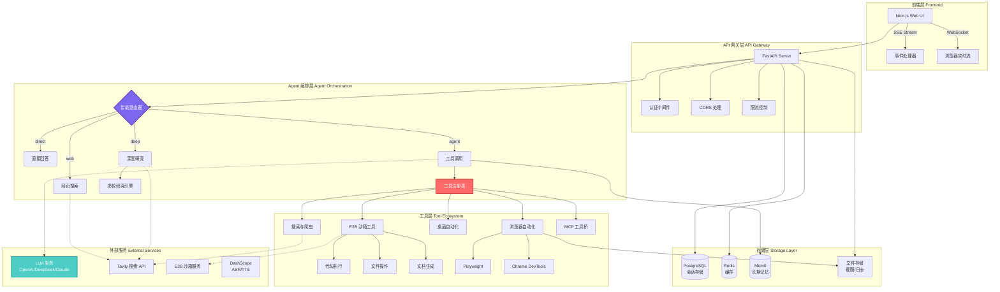
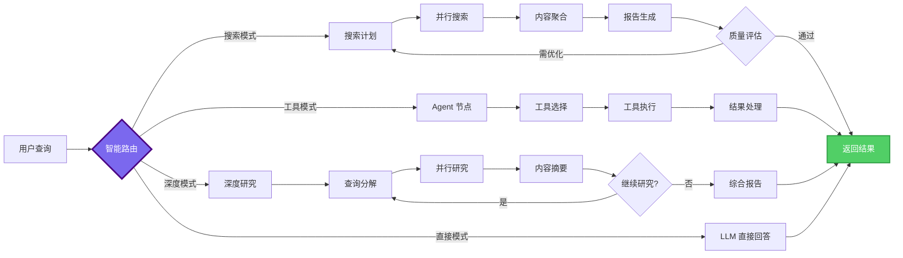

<div align="right">
  <details>
    <summary>🌐 Language / 语言</summary>
    <div>  
      <div align="center">
        <strong>简体中文</strong> | <a href="README.en.md">English</a>
      </div>
    </div>
  </details>
</div>

<div align="center">

# 🕸️ Weaver - AI 智能体平台

**基于 LangGraph 的企业级 AI Agent 平台 · 深度研究 · 代码执行 · 浏览器自动化 · 多模态交互**


[在线演示](https://weaver-demo.vercel.app) · [文档](docs/) · [问题反馈](https://github.com/skygazer42/weaver/issues) · [功能请求](https://github.com/skygazer42/weaver/issues)


</div>

---

## 📝 项目介绍

在人工智能快速发展的今天，如何构建一个既强大又灵活的 AI Agent 系统成为了开发者们关注的焦点。**Weaver** 正是为此而生 —— 它是一个开源的、生产级的 AI 智能体平台，融合了最新的 LLM 技术、工作流编排和工具生态。

受到 [Manus](https://manus.im) 的启发，Weaver 不仅提供了强大的智能路由、深度研究、代码执行等核心能力，更重要的是，它采用模块化设计，让开发者可以轻松定制和扩展。无论是构建研究助手、自动化工作流，还是智能客服系统，Weaver 都能成为你的得力助手。

### 🎯 为什么选择 Weaver？

- **🧠 智能路由系统**：基于 LLM 的查询分类，自动选择最优处理策略（直接回答/网页搜索/工具调用/深度研究）
- **🔍 深度研究能力**：多轮迭代式研究，支持并行搜索、内容爬取和智能摘要
- **🛠️ 丰富的工具生态**：62+ 内置工具，涵盖浏览器自动化、代码执行、文档生成、桌面控制等
- **🎨 类 GPTs 配置**：支持多 Agent 配置，每个 Agent 可自定义工具集和系统提示词
- **🔄 触发器系统**：支持定时任务（Cron）、Webhook 和事件驱动的自动化流程
- **🎤 多模态交互**：语音识别（ASR）、文字转语音（TTS）、图像处理
- **🧩 高度可扩展**：MCP 协议支持、插件化架构、自定义工具开发

本项目致力于打造一个**可迁移、可扩展、面向开发者**的智能体平台模板系统。你可以基于 Weaver 快速构建专属领域的 AI 助手，仅需调整提示词和工具配置，即可实现高质量的智能交互体验。

---

## 🎯 系统架构

Weaver 采用前后端分离的现代化架构，后端基于 FastAPI + LangGraph 构建工作流引擎，前端使用 Next.js + Tailwind CSS 提供流畅的用户体验。系统支持实时事件流（SSE）、任务取消、会话持久化等企业级特性。

以下是 Weaver 的核心技术架构图：



### 工作流执行示意图



---

## 🎯 项目特色

### 核心能力

1. **🧠 智能路由系统** - 基于 LLM 的查询分类器，自动识别用户意图并选择最优处理策略
2. **🔍 深度研究引擎** - 多轮迭代式研究，支持查询分解、并行搜索、智能摘要和质量评估
3. **💻 安全代码执行** - 基于 E2B 沙箱的 Python 解释器，支持 matplotlib、pandas、numpy 等科学计算库
4. **🌐 浏览器自动化** - Playwright + E2B 双模式，支持页面交互、截图、实时画面流
5. **🖥️ 桌面自动化** - PyAutoGUI 实现鼠标、键盘和屏幕控制
6. **📊 文档生成** - 自动生成 Excel 报表和 PowerPoint 演示文稿
7. **🔄 触发器系统** - 支持 Cron 定时任务、Webhook 回调和事件驱动
8. **🎤 语音交互** - 集成阿里 DashScope 实现 ASR 和 TTS
9. **🧩 MCP 协议支持** - 模型上下文协议（Model Context Protocol）工具桥接
10. **🎨 多 Agent 配置** - 类似 GPTs 的配置系统，支持自定义工具集和提示词

### 工具生态（62+ 工具）

```
🔧 E2B 沙箱工具
├── 浏览器自动化（11 个工具）
│   ├── 页面导航、点击、输入
│   ├── 截图、滚动、等待
│   └── 内容提取、表单填写
├── 文件操作（8 个工具）
│   ├── 创建、读取、编辑、删除
│   ├── 查找替换、下载
│   └── 目录管理
├── Shell 命令（5 个工具）
│   ├── 命令执行、包安装
│   ├── 端口暴露、进程管理
│   └── npm/pip/apt 包管理
├── 文档生成（15 个工具）
│   ├── Excel 表格（创建、编辑、样式）
│   ├── PowerPoint 演示（幻灯片、图表）
│   └── CSV 导出
└── 图像处理（7 个工具）
    ├── OCR 文字提取
    ├── 图片缩放、裁剪、转换
    └── 二维码识别

🖥️ 桌面自动化工具（9 个）
├── 鼠标控制（移动、点击、拖拽）
├── 键盘输入（打字、快捷键）
├── 屏幕截图
└── 窗口管理

🌐 搜索与爬虫工具
├── Tavily API 搜索
├── 可视化搜索（带截图）
├── URL 内容爬取
└── 多搜索引擎支持

💻 代码执行工具
└── Python 沙箱解释器
    ├── 科学计算（numpy、pandas）
    ├── 数据可视化（matplotlib）
    └── 结果以 Base64 返回
```

### 技术亮点

- **🚀 高性能**：异步架构 + 连接池优化，支持高并发请求
- **🔒 安全可靠**：E2B 沙箱隔离、工具审批机制、速率限制
- **📡 实时推送**：SSE 事件流 + WebSocket，实时查看工具执行过程
- **🛑 任务控制**：基于 Token 的任务取消机制，支持优雅关闭
- **🧠 记忆系统**：短期记忆（PostgreSQL Checkpointer）+ 长期记忆（Mem0/Redis）
- **📊 可观测性**：结构化日志、Prometheus 指标、性能监控
- **🎨 现代化 UI**：基于 Shadcn UI 的美观界面，支持暗色模式

---

## 🚀 快速开始

> **前置要求**：
> - Python 3.11+ 
> - Node.js 18+
> - Docker & Docker Compose（可选，用于 PostgreSQL）
> - 至少 1 个 LLM API Key（OpenAI/DeepSeek/Claude 等）

### 第一步：克隆仓库

```bash
git clone https://github.com/skygazer42/weaver.git
cd weaver
```

### 第二步：配置环境变量

```bash
# 复制环境变量模板
cp .env.example .env

# 编辑 .env 文件，填写必需的 API Keys
nano .env  # 或使用其他编辑器
```

**必需配置项**：

```bash
# LLM 服务（三选一）
OPENAI_API_KEY=sk-...                    # OpenAI
# 或
OPENAI_API_KEY=sk-...                    # DeepSeek（兼容 OpenAI 格式）
OPENAI_BASE_URL=https://api.deepseek.com/v1
# 或
ANTHROPIC_API_KEY=sk-ant-...             # Claude

# 搜索服务
TAVILY_API_KEY=tvly-...                  # 从 https://tavily.com 获取

# 代码执行（可选，推荐）
E2B_API_KEY=e2b_...                      # 从 https://e2b.dev 获取
```

**可选配置项**：

```bash
# 语音服务（阿里 DashScope）
DASHSCOPE_API_KEY=sk-...                 # ASR + TTS

# 长期记忆
ENABLE_MEMORY=true
MEM0_API_KEY=m0-...                      # 从 https://mem0.ai 获取

# MCP 工具桥
ENABLE_MCP=true
MCP_SERVERS={"filesystem": {...}}
```

### 第三步：安装依赖

**方法 A：一键安装（推荐）**

```bash
npm run install:all
```

**方法 B：手动安装**

```bash
# 后端依赖
pip install -r requirements.txt

# 前端依赖
cd web
npm install
cd ..

# 可选：浏览器自动化
pip install playwright
playwright install chromium

# 可选：桌面自动化
pip install pyautogui pillow
```

### 第四步：启动数据库（可选）

```bash
# 使用 Docker 启动 PostgreSQL
docker-compose up postgres -d

# 或者使用内存存储（无需数据库）
# 将 .env 中的 DATABASE_URL 留空即可
```

### 第五步：启动服务

**方法 A：同时启动前后端**

```bash
npm run dev
```

**方法 B：分别启动**

```bash
# 终端 1：启动后端
python main.py

# 终端 2：启动前端
cd web
pnpm run dev -- -p 8080  # 使用端口 8080（如果 3000 被占用）
```

### 第六步：访问应用

- 🌐 **前端界面**：http://localhost:8080
- 🔌 **后端 API**：http://localhost:8000
- 📖 **API 文档**：http://localhost:8000/docs
- 📊 **监控指标**：http://localhost:8000/metrics（需启用 Prometheus）

---

## 📚 使用指南

### 基本对话

1. 打开 Web 界面
2. 在输入框输入问题，例如："介绍一下 LangGraph"
3. 选择模式：
   - **直接模式**：LLM 直接回答
   - **搜索模式**：联网搜索后回答
   - **工具模式**：调用工具辅助回答
   - **深度模式**：多轮深度研究

### 深度研究示例

```
用户：深入研究一下 2024 年人工智能的最新进展

系统：[启动深度研究模式]
  → 第 1 轮：生成 5 个子查询
    - "2024 年 AI 重大突破"
    - "大语言模型最新进展"
    - "AI 应用落地案例"
    - "AI 安全与伦理"
    - "AI 产业发展趋势"
  → 并行搜索 15 个结果
  → 内容摘要与分析
  → 第 2 轮：针对关键点深挖
  → 生成 8000 字综合报告
```

### 代码执行示例

```python
用户：画一个 2024 年中国 GDP 增长趋势图

系统：[调用 execute_python_code 工具]
```python
import matplotlib.pyplot as plt
import numpy as np

quarters = ['Q1', 'Q2', 'Q3', 'Q4']
gdp = [5.3, 4.7, 4.6, 5.4]

plt.figure(figsize=(10, 6))
plt.plot(quarters, gdp, marker='o', linewidth=2, markersize=8)
plt.title('2024年中国GDP季度增长率', fontsize=16)
plt.ylabel('增长率 (%)', fontsize=12)
plt.grid(True, alpha=0.3)
plt.show()
```

系统：[返回图表 Base64 + 展示]
```

### 浏览器自动化示例

```
用户：帮我打开百度，搜索"LangGraph 教程"，并截图

系统：[调用沙箱浏览器工具]
  1. sb_browser_navigate: 访问 https://www.baidu.com
  2. sb_browser_type: 在搜索框输入"LangGraph 教程"
  3. sb_browser_click: 点击"百度一下"按钮
  4. sb_browser_screenshot: 截取搜索结果页面
  
[返回截图]
```

---

## ⚙️ 高级配置

### Agent 配置（类 GPTs）

在 `data/agents.json` 中配置自定义 Agent：

```json
{
  "id": "research_assistant",
  "name": "研究助手",
  "description": "专注于学术研究的 AI 助手",
  "system_prompt": "你是一位专业的学术研究助手，擅长文献检索、数据分析和报告撰写...",
  "model": "gpt-4o",
  "enabled_tools": {
    "web_search": true,
    "crawl": true,
    "python": true,
    "sandbox_browser": true,
    "sandbox_sheets": true,
    "sandbox_presentation": true,
    "mcp": false,
    "computer_use": false
  },
  "metadata": {
    "author": "Your Name",
    "version": "1.0.0"
  }
}
```

### 触发器配置

**定时任务示例**（每天早上 9 点生成日报）：

```python
from triggers import TriggerManager, ScheduledTrigger

manager = TriggerManager()

trigger = ScheduledTrigger(
    name="daily_report",
    description="每日新闻摘要",
    schedule="0 9 * * *",  # Cron 表达式
    agent_id="research_assistant",
    task="生成今日科技新闻摘要，包括 AI、芯片、新能源三个领域",
    timezone="Asia/Shanghai",
    run_immediately=False
)

await manager.add_trigger(trigger)
```

**Webhook 示例**（接收 GitHub 事件）：

```python
webhook = WebhookTrigger(
    name="github_webhook",
    description="GitHub 事件通知",
    agent_id="default",
    task="分析 GitHub 事件: {payload.action}",
    http_methods=["POST"],
    require_auth=True,
    rate_limit=100  # 每小时最多 100 次
)

await manager.add_trigger(webhook)
# 返回: /api/webhook/trigger_abc123 和 auth_token
```

### MCP 工具集成

Weaver 支持 MCP（Model Context Protocol），可以轻松集成第三方工具：

```json
{
  "mcpServers": {
    "filesystem": {
      "command": "npx",
      "args": ["-y", "@modelcontextprotocol/server-filesystem", "/path/to/allowed"],
      "env": {}
    },
    "github": {
      "command": "npx",
      "args": ["-y", "@modelcontextprotocol/server-github"],
      "env": {
        "GITHUB_TOKEN": "ghp_..."
      }
    }
  }
}
```

---

## 🛠️ 工具参考

### 完整工具列表

| 分类 | 工具数量 | 示例工具 |
|-----|---------|---------|
| **沙箱浏览器** | 11 | `sb_browser_navigate`, `sb_browser_click`, `sb_browser_screenshot` |
| **沙箱文件** | 8 | `sandbox_create_file`, `sandbox_read_file`, `sandbox_str_replace` |
| **沙箱 Shell** | 5 | `sandbox_execute_command`, `sandbox_install_package` |
| **沙箱表格** | 7 | `sandbox_create_spreadsheet`, `sandbox_add_sheet` |
| **沙箱演示** | 8 | `sandbox_create_presentation`, `sandbox_add_slide` |
| **沙箱图像** | 7 | `sandbox_resize_image`, `sandbox_extract_text` |
| **桌面控制** | 9 | `computer_move_mouse`, `computer_click`, `computer_screenshot` |
| **任务管理** | 4 | `create_tasks`, `view_tasks`, `update_task` |
| **搜索爬虫** | 2 | `web_search`, `crawl` |
| **代码执行** | 1 | `execute_python_code` |

**总计：62 个工具**

详细文档请查看：[TOOL_REFERENCE.md](docs/TOOL_REFERENCE.md)

---

## 📡 API 参考

### 核心 API 端点

#### 1. 聊天接口

**POST** `/api/chat`

```json
{
  "messages": [
    {"role": "user", "content": "介绍一下 Weaver"}
  ],
  "stream": true,
  "model": "gpt-4o",
  "search_mode": "agent",  // direct|web|agent|deep
  "agent_id": "default",
  "user_id": "user_123"
}
```

**返回**：SSE 流式事件

```
0:{"type":"status","data":{"text":"正在初始化...","step":"init"}}
0:{"type":"text","data":{"content":"Weaver 是一个..."}}
0:{"type":"tool_start","data":{"tool_name":"web_search","args":{...}}}
0:{"type":"tool_result","data":{"tool_name":"web_search","result":{...}}}
0:{"type":"done","data":{"timestamp":"2024-01-01T00:00:00"}}
```

#### 2. 取消任务

**POST** `/api/chat/cancel/{thread_id}`

```json
{
  "reason": "用户取消"
}
```

#### 3. Agent 管理

```bash
GET    /api/agents           # 列出所有 Agent
GET    /api/agents/{id}      # 获取 Agent 详情
POST   /api/agents           # 创建 Agent
PUT    /api/agents/{id}      # 更新 Agent
DELETE /api/agents/{id}      # 删除 Agent
```

#### 4. 触发器管理

```bash
GET    /api/triggers                # 列出触发器
POST   /api/triggers/scheduled      # 创建定时任务
POST   /api/triggers/webhook        # 创建 Webhook
POST   /api/triggers/{id}/pause     # 暂停触发器
POST   /api/triggers/{id}/resume    # 恢复触发器
DELETE /api/triggers/{id}           # 删除触发器
```

#### 5. 语音接口

```bash
POST /api/asr/recognize      # 语音识别
POST /api/tts/synthesize     # 文字转语音
GET  /api/tts/voices         # 获取可用语音列表
```

完整 API 文档：http://localhost:8000/docs

---

## 🧪 开发指南

### 本地开发

```bash
# 后端热重载
uvicorn main:app --reload --host 0.0.0.0 --port 8000

# 前端热重载
cd web && pnpm run dev

# 数据库
docker-compose up postgres -d
```

### 运行测试

```bash
# 单元测试
pytest tests/ -v

# API 冒烟测试
python tests/test_smoke_api.py

# 深度搜索路由测试
python scripts/test_deep_search_routing.py
```

### 代码规范

```bash
# 格式化
black . --line-length 120
isort . --profile black

# 类型检查
mypy agent/ tools/ common/

# Lint
ruff check .
```

### 调试模式

在 `.env` 中启用调试：

```bash
DEBUG=true
LOG_LEVEL=DEBUG
ENABLE_FILE_LOGGING=true
```

查看日志：

```bash
# 主日志
tail -f logs/weaver.log

# 线程日志
tail -f logs/threads/{thread_id}.log
```

---

## 🚢 部署指南

### Docker 部署

```bash
# 构建镜像
docker build -t weaver-backend .

# 运行容器
docker run -d \
  -p 8000:8000 \
  --env-file .env \
  --name weaver \
  weaver-backend
```

### Docker Compose 全栈部署

```bash
# 启动所有服务
docker-compose up -d

# 查看日志
docker-compose logs -f backend

# 停止服务
docker-compose down
```

### 前端部署（Vercel）

```bash
cd web
vercel deploy --prod
```

在 Vercel 环境变量中配置：

```bash
NEXT_PUBLIC_API_URL=https://your-backend.com
```

### 后端部署（Railway/Render）

启动命令：

```bash
uvicorn main:app --host 0.0.0.0 --port $PORT
```

环境变量：参考 `.env.example`

---

## 🔧 常见问题

### 1. 端口 3000 被占用（EACCES 错误）

**原因**：Windows Hyper-V 保留了端口范围 3000-3100

**解决方案**：

```bash
# 方案 1：使用其他端口
cd web && pnpm run dev -- -p 8080

# 方案 2：以管理员身份运行 PowerShell
netsh interface ipv4 show excludedportrange protocol=tcp
netsh interface ipv4 delete excludedportrange protocol=tcp startport=3000 numberofports=2
```

### 2. E2B 沙箱连接失败

**检查清单**：

- API Key 是否正确
- 网络是否可以访问 e2b.dev
- 是否有代理设置

```bash
# 测试连接
python -c "from e2b_code_interpreter import Sandbox; s = Sandbox(); print('OK')"
```

### 3. Deep Search 未执行

**原因**：路由决策未正确识别

**解决方案**：

- 检查 `search_mode` 参数是否为 `"deep"`
- 查看日志确认路由决策：`grep "route_decision" logs/weaver.log`
- 运行诊断脚本：`python scripts/test_deep_search_routing.py`

### 4. 数据库连接错误

```bash
# 启动 PostgreSQL
docker-compose up postgres -d

# 测试连接
psql $DATABASE_URL -c "SELECT 1"
```

### 5. 前端无法连接后端

检查 `web/next.config.js` 中的 API 地址：

```javascript
env: {
  NEXT_PUBLIC_API_URL: 'http://127.0.0.1:8000',
}
```

---

## 📚 相关文档

| 文档 | 说明 |
|------|------|
| [TOOL_REFERENCE.md](docs/TOOL_REFERENCE.md) | 完整工具文档 |
| [DEEP_SEARCH_TROUBLESHOOTING.md](docs/DEEP_SEARCH_TROUBLESHOOTING.md) | 深度搜索诊断指南 |
| [FRONTEND_INTEGRATION.md](docs/FRONTEND_INTEGRATION.md) | 前端集成指南 |
| [MANUS_FEATURE_ANALYSIS.md](docs/MANUS_FEATURE_ANALYSIS.md) | Manus 特性对比 |

---

## 🗺️ 开发路线图

### ✅ 已完成（v0.9 - 92%）

**核心系统**
- [x] LangGraph 工作流引擎
- [x] 智能路由系统
- [x] 上下文管理（Token 计数、截断）
- [x] 事件流（SSE）
- [x] 任务取消机制
- [x] 多 Agent 配置（类 GPTs）

**搜索与研究**
- [x] 深度搜索（多轮迭代）
- [x] 智能路由器（基于置信度）
- [x] 并行搜索与去重
- [x] 结果聚合与排序
- [x] 网页搜索（Tavily API）
- [x] 可视化搜索（截图）
- [x] URL 爬取

**工具生态**
- [x] E2B 沙箱（62+ 工具）
- [x] 浏览器自动化
- [x] 桌面自动化
- [x] 代码执行
- [x] 文档生成
- [x] 图像处理

**其他特性**
- [x] 触发器系统
- [x] 语音 I/O
- [x] 长期记忆
- [x] MCP 集成
- [x] Prometheus 监控
- [x] Docker 部署


---

## 🤝 贡献指南

我们欢迎各种形式的贡献！无论是报告 Bug、提出新功能建议，还是提交代码改进。

### 贡献流程

1. Fork 本仓库
2. 创建特性分支 (`git checkout -b feature/AmazingFeature`)
3. 提交更改 (`git commit -m 'Add some AmazingFeature'`)
4. 推送到分支 (`git push origin feature/AmazingFeature`)
5. 提交 Pull Request

### 开发环境搭建

```bash
git clone https://github.com/skygazer42/weaver.git
cd weaver
cp .env.example .env
npm run install:all
npm run dev
```

### 代码规范

- Python 代码遵循 PEP 8
- 使用 Black 进行格式化
- 添加类型提示
- 为新功能编写测试
- 更新相关文档

---

## 📄 开源协议

本项目采用 [MIT License](LICENSE) 开源协议。你可以自由地使用、修改和分发本项目，但请保留原作者信息。

---

## 🙏 致谢

- **灵感来源**：[Manus](https://manus.im) - 最佳 AI Agent 平台
- **核心框架**：[LangGraph](https://github.com/langchain-ai/langgraph) - Agent 编排引擎
- **沙箱服务**：[E2B](https://e2b.dev) - 代码执行环境
- **搜索服务**：[Tavily](https://tavily.com) - AI 优化的搜索 API
- **UI 组件**：[Shadcn UI](https://ui.shadcn.com) - 精美的 React 组件

---

## 📞 联系我们

- **问题反馈**：[GitHub Issues](https://github.com/skygazer42/weaver/issues)
- **讨论交流**：[GitHub Discussions](https://github.com/skygazer42/weaver/discussions)
- **Twitter**：[@WeaverAI](https://twitter.com/WeaverAI)
- **Discord**：[加入社区](https://discord.gg/weaver)

---

<div align="center">

**[⬆ 返回顶部](#-weaver---ai-智能体平台)**

用 ❤️ 打造 | Made with ❤️ by Weaver Team

</div>

