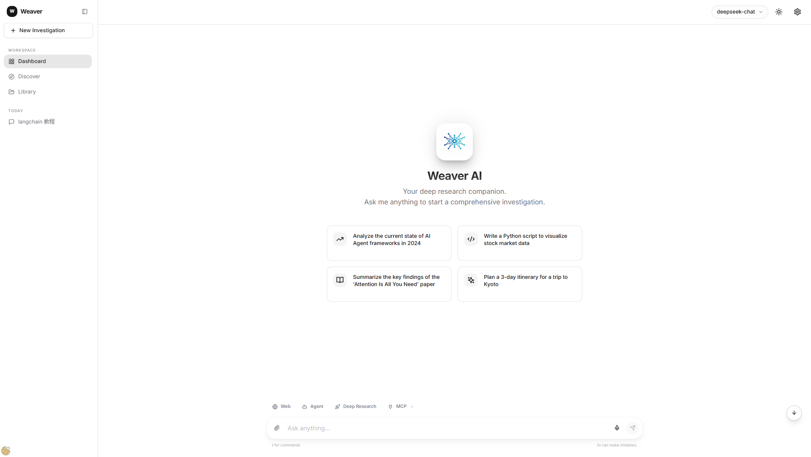

<div align="right">
  <strong>简体中文</strong> |
  <a href="docs/README.en.md">English</a>
</div>

<div align="center">

# Weaver - AI 智能体平台模板

**基于 LangGraph 的开源 AI Agent 平台模板 · Deep Research · 工具调用 · 代码执行 · 浏览器自动化 · 多模态交互**


[在线演示](https://weaver-demo.vercel.app) · [文档](docs/README.md) · [问题反馈](https://github.com/skygazer42/weaver/issues) · [讨论区](https://github.com/skygazer42/weaver/discussions)



</div>

---

## 你能用 Weaver 做什么

- **智能路由**：自动选择 direct / web / agent / deep（四种策略）
- **Deep Research**：并行检索 + 多轮迭代 + 引用证据（UI 可点击核对）
- **工具生态**：沙箱代码执行、浏览器自动化、文件/文档生成、桌面控制（可选）
- **可扩展**：支持 MCP（Model Context Protocol）桥接第三方工具
- **契约对齐**：OpenAPI → 前端/SDK TS types 自动生成，避免接口漂移
- **流式体验**：SSE 事件流 + 工具 activity 面板 + 长代码输出（虚拟滚动/查找/全屏）

---

## 快速开始（本地 2 分钟跑起来）

> 更完整的步骤（E2B / Playwright / MCP / Docker Compose）见：`docs/getting-started.md`

```bash
git clone https://github.com/skygazer42/weaver.git
cd weaver

# 1) 配置环境变量
cp .env.example .env
cp web/.env.local.example web/.env.local

# 你至少需要在 .env 里填写：
# - OPENAI_API_KEY（或 ANTHROPIC_API_KEY / DeepSeek 兼容配置）
# - TAVILY_API_KEY

# 2) 安装依赖
make setup
pnpm -C web install --frozen-lockfile

# 3) 启动服务
.venv/bin/python main.py
pnpm -C web dev
```

访问入口：

- 前端界面：http://localhost:3100
- 后端 API：http://localhost:8001
- OpenAPI 文档：http://localhost:8001/docs

---

## 文档导航

| 文档 | 说明 |
|------|------|
| [快速开始](docs/getting-started.md) | 本地运行、依赖安装、常用命令 |
| [系统架构](docs/architecture.md) | 架构图与工作流示意（Mermaid） |
| [配置说明](docs/configuration.md) | `.env` / `web/.env.local` / Agent / 触发器 / MCP |
| [使用指南](docs/usage.md) | 模式选择、Deep Research、代码执行、浏览器自动化 |
| [部署与加固](docs/deployment.md) | Docker/Compose、反代鉴权、限流、SSE 注意事项 |
| [开发指南](docs/development.md) | 本地开发脚本、测试、Lint、日志 |
| [API 说明](docs/api.md) | OpenAPI 合约、常用端点、SSE 调用示例 |
| [流式协议](docs/chat-streaming.md) | SSE/legacy 协议细节与回滚策略 |
| [OpenAPI 合约对齐](docs/openapi-contract.md) | 后端 ↔ 前端 types 自动生成（防漂移） |
| [MCP 集成](docs/mcp.md) | MCP servers 配置与安全建议 |
| [Benchmarks](docs/benchmarks/README.md) | Deep Research 回归与样例集 |
| [路线图](docs/roadmap.md) | 规划与方向 |

---

## 贡献与安全

- 贡献指南：`CONTRIBUTING.md`
- 安全说明：`SECURITY.md`
- 行为准则：`CODE_OF_CONDUCT.md`

---

## 开源协议

MIT License，详见 `LICENSE`。
