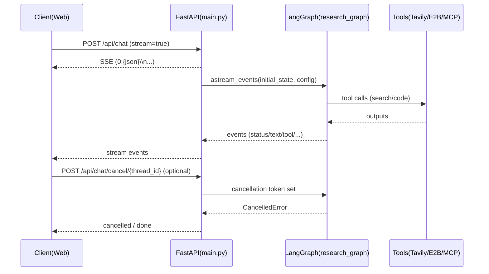

# 运行生命周期（流式 / 取消 / 中断）

本文档描述一次“流式对话/研究”从开始到结束的生命周期，以及 `thread_id`、取消令牌、checkpoint 的关系。

## 1. 一次流式运行的时序

以 `/api/chat`（`stream=true`）为例：

1) 客户端 `POST /api/chat`  
2) 后端生成 `thread_id`，并在响应头返回 `X-Thread-ID`  
3) 后端启动 `stream_agent_events(...)`，开始把 LangGraph 事件转换为数据流协议输出  
4) 客户端持续读取并渲染事件，直到收到 `done` / `error` / `cancelled`

可视化时序（简化）：

## 2. `thread_id` 的用途

在 Weaver 当前实现中，`thread_id` 同时被用于：

- 取消：`common/cancellation.py` 里 token 的 `task_id`
- LangGraph configurable：`configurable.thread_id`（用于 checkpoint 标识）
- 线程日志：`logs/threads/{thread_id}.log`（如果启用）
- 指标统计：`common/metrics.py` 的键

注意：当前 `/api/chat` 的 `thread_id` 是按请求随机生成的“运行 ID”，不是“长期会话线程”。如果你要做“多轮持续对话”，通常需要把 `thread_id` 固定下来，并让前端持续传入历史 `messages`。

## 3. 流式协议与事件类型

Weaver 输出使用 Vercel AI SDK Data Stream Protocol：每行 `0:{json}\n`。

常见 event `type`（见 `main.py#stream_agent_events`）：

- `status`：阶段提示（如 planning/searching/writing）
- `plan`：研究计划结构化信息
- `tool`：工具开始/结束（search/code_execution 等）
- `artifact`：可视化/文件等产物（例如代码执行产图）
- `text`：LLM token 增量
- `done`：完成（可能带 metrics）
- `error`：异常
- `cancelled`：被取消

## 4. 取消机制

### 4.1 取消入口

- `POST /api/chat/cancel/{thread_id}`：取消指定运行
- `POST /api/chat/cancel-all`：取消全部运行
- `GET /api/tasks/active`：查看活跃运行与取消统计

### 4.2 取消如何生效

- `stream_agent_events` 会创建 `CancellationToken`，并在关键点检查
- 节点/工具执行前后也会调用取消检查（见 `agent/nodes.py` 的相关逻辑）
- 一旦取消，流会输出 `cancelled` 事件并结束

## 5. 中断与恢复（interrupt/resume）

`POST /api/interrupt/resume` 主要用于 human-in-the-loop：

- 只有启用 checkpointer（例如配置了 `DATABASE_URL`）时才可能恢复
- 若目标 `thread_id` 在 checkpoint 中不存在，后端会返回 404（属于预期行为）
