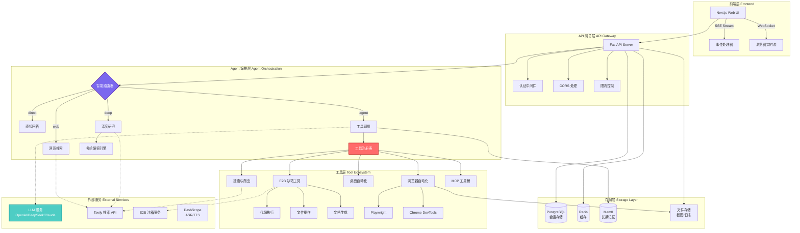
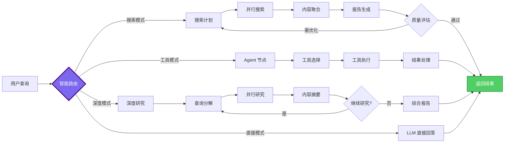

# 系统架构

Weaver 采用前后端分离的现代化架构：

- 后端：FastAPI + LangGraph（工作流编排、工具调用、流式输出）
- 前端：Next.js（SSE 事件流渲染、研究证据查看、代码块/工具活动展示）

---

## 核心架构图（概览）

```mermaid
graph TB
    subgraph "前端层 Frontend"
        UI[Next.js Web UI]
        UI --> |SSE Stream| EventHandler[事件处理器]
        UI --> |WebSocket| BrowserStream[浏览器实时流]
    end

    subgraph "API 网关层 API Gateway"
        FastAPI[FastAPI Server]
        FastAPI --> Auth[认证中间件]
        FastAPI --> CORS[CORS 处理]
        FastAPI --> Rate[限流控制]
    end

    subgraph "Agent 编排层 Agent Orchestration"
        Router{智能路由器}
        Router --> |direct| DirectNode[直接回答]
        Router --> |web| WebNode[网页搜索]
        Router --> |agent| AgentNode[工具调用]
        Router --> |deep| DeepNode[深度研究]

        AgentNode --> ToolRegistry[工具注册表]
        DeepNode --> MultiEpoch[多轮研究引擎]
    end

    subgraph "工具层 Tool Ecosystem"
        ToolRegistry --> Sandbox[E2B 沙箱工具]
        ToolRegistry --> Browser[浏览器自动化]
        ToolRegistry --> Desktop[桌面自动化]
        ToolRegistry --> Search[搜索与爬虫]
        ToolRegistry --> MCP[MCP 工具桥]

        Sandbox --> CodeExec[代码执行]
        Sandbox --> FileOps[文件操作]
        Sandbox --> DocGen[文档生成]

        Browser --> Playwright[Playwright]
        Browser --> CDP[Chrome DevTools]
    end

    subgraph "存储层 Storage Layer"
        PG[(PostgreSQL<br/>会话存储)]
        Redis[(Redis<br/>缓存)]
        Mem0[(Mem0<br/>长期记忆)]
        FileStore[文件存储<br/>截图/日志]
    end

    subgraph "外部服务 External Services"
        LLM[LLM 服务<br/>OpenAI/DeepSeek/Claude]
        TavilyAPI[Tavily 搜索 API]
        E2B[E2B 沙箱服务]
        DashScope[DashScope<br/>ASR/TTS]
    end

    UI --> FastAPI
    FastAPI --> Router

    AgentNode -.-> LLM
    WebNode -.-> TavilyAPI
    DeepNode -.-> TavilyAPI

    Sandbox -.-> E2B
    Search -.-> TavilyAPI

    FastAPI --> PG
    FastAPI --> Redis
    AgentNode --> Mem0

    Browser --> FileStore
    FastAPI --> FileStore

    style Router fill:#7B68EE,stroke:#4B0082,stroke-width:2px,color:#fff
    style ToolRegistry fill:#FF6B6B,stroke:#C92A2A,stroke-width:2px,color:#fff
    style LLM fill:#4ECDC4,stroke:#0A9396,stroke-width:2px,color:#fff
```

---

## 工作流执行示意图

```mermaid
graph LR
    A[用户查询] --> B{智能路由}

    B -->|直接模式| C[LLM 直接回答]
    B -->|搜索模式| D[搜索计划]
    B -->|工具模式| E[Agent 节点]
    B -->|深度模式| F[深度研究]

    D --> D1[并行搜索]
    D1 --> D2[内容聚合]
    D2 --> D3[报告生成]
    D3 --> D4{质量评估}
    D4 -->|通过| G[返回结果]
    D4 -->|需优化| D

    E --> E1[工具选择]
    E1 --> E2[工具执行]
    E2 --> E3[结果处理]
    E3 --> G

    F --> F1[查询分解]
    F1 --> F2[并行研究]
    F2 --> F3[内容摘要]
    F3 --> F4{继续研究?}
    F4 -->|是| F1
    F4 -->|否| F5[综合报告]
    F5 --> G

    C --> G

    style B fill:#7B68EE,stroke:#4B0082,stroke-width:3px,color:#fff
    style G fill:#51CF66,stroke:#2F9E44,stroke-width:2px,color:#fff
```
