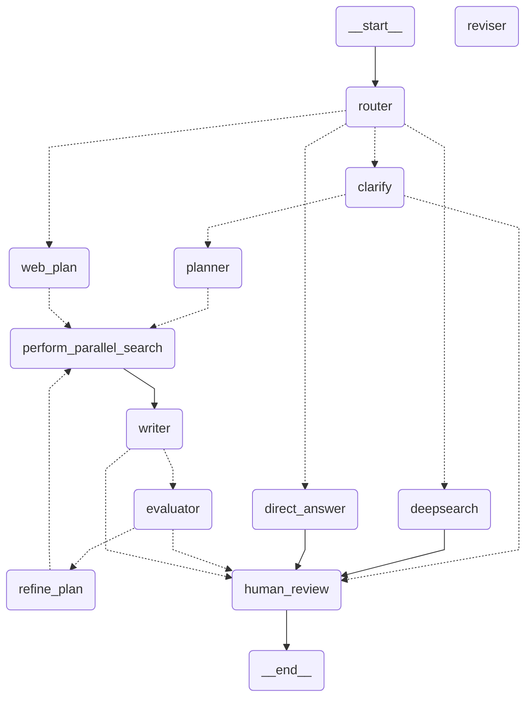

```mermaid
---
config:
  flowchart:
    curve: linear
---
graph TD;
	__start__(<p>__start__</p>)
	router(router)
	direct_answer(direct_answer)
	clarify(clarify)
	planner(planner)
	web_plan(web_plan)
	refine_plan(refine_plan)
	perform_parallel_search(perform_parallel_search)
	writer(writer)
	evaluator(evaluator)
	reviser(reviser)
	human_review(human_review)
	deepsearch(deepsearch)
	__end__(<p>__end__</p>)
	__start__ --> router;
	clarify -.-> human_review;
	clarify -.-> planner;
	deepsearch --> human_review;
	direct_answer --> human_review;
	evaluator -.-> human_review;
	evaluator -.-> refine_plan;
	perform_parallel_search --> writer;
	planner -.-> perform_parallel_search;
	refine_plan -.-> perform_parallel_search;
	router -.-> clarify;
	router -.-> deepsearch;
	router -.-> direct_answer;
	router -.-> web_plan;
	web_plan -.-> perform_parallel_search;
	writer -.-> evaluator;
	writer -.-> human_review;
	human_review --> __end__;
	classDef default fill:#f2f0ff,line-height:1.2
	classDef first fill-opacity:0
	classDef last fill:#bfb6fc

```